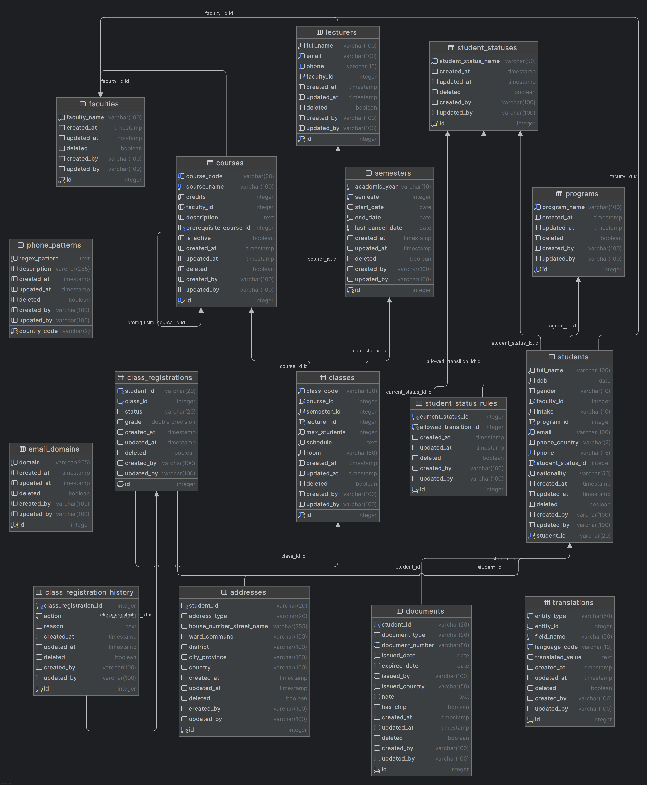

# Student Management System Database

A comprehensive PostgreSQL database schema for managing academic institutions, supporting student lifecycle management, course enrollment, and complex academic workflows.

## 🏗️ Database Architecture Overview

The database follows a normalized relational design with clear separation between:

- **Core academic entities** (students, courses, classes)
- **Supporting reference data** (faculties, programs, statuses)
- **Audit and validation tables** (history, rules, patterns)

The schema supports complex academic workflows including student lifecycle management, course prerequisites, class enrollment, and status transition rules.

## 📊 Entity Relationship Diagram

The system is built around these core relationships:



## 🗂️ Database Schema

### Core Entity Tables

#### Student Management

| Table       | Primary Key            | Purpose                  | Key Constraints                              |
| ----------- | ---------------------- | ------------------------ | -------------------------------------------- |
| `students`  | `student_id` (VARCHAR) | Core student information | Unique email, phone; gender check constraint |
| `addresses` | `id` (SERIAL)          | Student address records  | Multiple address types per student           |
| `documents` | `id` (SERIAL)          | Identity documents       | Unique document numbers; date validations    |

**Key Features:**

- Custom VARCHAR student IDs supporting institutional formats
- Gender field with Vietnamese language values (`'Nam', 'Nữ', 'Khác'`)
- International phone number support with country codes
- Multiple address types per student

#### Academic Reference Tables

| Table              | Purpose              | Key Fields                     | Business Rules              |
| ------------------ | -------------------- | ------------------------------ | --------------------------- |
| `faculties`        | Academic departments | `faculty_name` (unique)        | Soft deletion support       |
| `programs`         | Study programs       | `program_name` (unique)        | References academic tracks  |
| `student_statuses` | Enrollment status    | `student_status_name` (unique) | Supports status transitions |

**Sample Data:**

- Faculties: "Khoa Luật", "Khoa Tiếng Anh thương mại"
- Student Statuses: "Đang học", "Đã tốt nghiệp", "Đã thôi học", "Tạm dừng học"

### Course and Class Management

#### Academic Catalog Structure

- **Courses**: Support hierarchical relationships with prerequisites
- **Classes**: Specific course offerings with enrollment limits
- **Semesters**: Academic periods with date validation
- **Lecturers**: Faculty members assigned to classes

**Key Features:**

- Self-referencing course prerequisites
- Active/inactive course status management
- Complex semester date validation
- Instructor assignment tracking

### Registration and Enrollment

#### Class Registration Status Flow

| Status       | Description                 | Grade Allowed    |
| ------------ | --------------------------- | ---------------- |
| `REGISTERED` | Active enrollment           | No               |
| `CANCELLED`  | Withdrawn before completion | No               |
| `COMPLETED`  | Finished with grade         | Yes (0-10 scale) |

#### Audit Trail

- `class_registration_history` maintains complete audit trail
- All status changes tracked with timestamps and reasons
- Supports compliance requirements and dispute resolution

## 🔄 Student Status State Machine

The system enforces valid student status transitions:

```
New Enrollment → DangHoc (Active Student)
                    ↓
    ┌─────────────────────────────────┐
    ↓                                 ↓
TamDungHoc (On Leave) ←→ DaThoiHoc (Withdrawn)
    ↓                                 ↓
DangHoc ←─────────────────────────────┤
    ↓                                 ↓
DaTotNghiep (Graduated) ←─────────────┘
```

Status transitions are enforced through the `student_status_rules` table with foreign key constraints.

## ✅ Business Rules and Validation

### Validation Support Tables

| Table            | Purpose                           | Key Fields                           |
| ---------------- | --------------------------------- | ------------------------------------ |
| `phone_patterns` | Country-specific phone validation | `country_code` (PK), `regex_pattern` |
| `email_domains`  | Allowed email domains             | `domain` (unique)                    |

**Phone Validation**: Supports international formats including Vietnam (`+84`), USA (`+1`), UK (`+44`), and 16 other countries.

**Email Validation**: Restricts registration to approved institutional or testing domains.

### Constraint Patterns

All tables follow consistent patterns:

| Pattern                | Implementation                                         | Purpose                 |
| ---------------------- | ------------------------------------------------------ | ----------------------- |
| **Soft Deletion**      | `deleted BOOLEAN DEFAULT FALSE`                        | Preserve data for audit |
| **Audit Trail**        | `created_at`, `updated_at`, `created_by`, `updated_by` | Track changes           |
| **Unique Constraints** | Business key uniqueness                                | Prevent duplicates      |
| **Check Constraints**  | Domain value validation                                | Enforce business rules  |

## 🚀 Database Setup

### Prerequisites

- PostgreSQL 12+
- Database user with CREATE privileges

### Installation Steps

1. **Create Database**

   ```sql
   CREATE DATABASE student_management;
   ```

2. **Run Schema Creation**

   ```bash
   psql -d student_management -f server/src/main/resources/db/1_create_table.sql
   ```

3. **Insert Sample Data**
   ```bash
   psql -d student_management -f server/src/main/resources/db/2_insert_data.sql
   ```

### Table Creation Order

Due to foreign key dependencies, tables must be created in this order:

1. **Reference Tables**: `faculties`, `student_statuses`, `programs`
2. **Core Tables**: `students`, `courses`, `semesters`, `lecturers`
3. **Relationship Tables**: `addresses`, `documents`, `classes`, `class_registrations`
4. **Business Rule Tables**: `student_status_rules`, `phone_patterns`, `email_domains`
5. **Audit Tables**: `class_registration_history`

## 📝 Sample Data

The initialization includes comprehensive sample data:

- **20 students** with diverse international backgrounds
- **4 faculties** representing different academic departments
- **10 courses** with prerequisite relationships
- **10 classes** across multiple semesters
- **Complete address and document records** for select students
- **Phone validation patterns** for 19 countries
- **Status transition rules** for all valid state changes

## 📁 File Structure

```
server/src/main/resources/db/
├── 1_create_table.sql    # Schema definition
└── 2_insert_data.sql     # Sample data insertion
```

## 🤝 Contributing

When modifying the schema:

1. Update both SQL files
2. Test with sample data
3. Update this README
4. Consider migration scripts for existing data

## 📄 License

This database schema is part of the Student Management System project.
