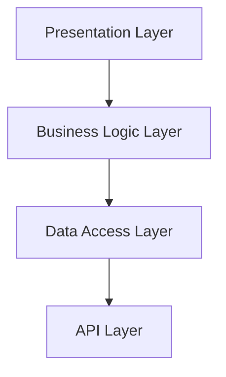

# Frontend Architecture Overview

## System Architecture

### Technology Stack

| Component | Technology | Purpose |
| --------- | ---------- | ------- |
| Framework | Next.js 14 | Core application framework |
| Language | TypeScript | Type-safe development |
| UI Library | Ant Design | Component library |
| State Management | TanStack Query | Server state management |
| Styling | Tailwind CSS, Ant Design | Responsive design and UI components |
| HTTP Client | Axios | API requests |
| Internationalization | next-intl, Custom Service | Multi-language support |
| Form Handling | Ant Design Forms | User input management |
| File Processing | XLSX | Excel import/export |

### Application Layers



## Core Features

### Student Management
- CRUD Operations
- Bulk Import/Export 
- Status Tracking

### Course Management  
- Course Catalog
- Prerequisites
- Scheduling
- Capacity Management

### Faculty Management
- Organizational Structure
- Staff Management
- Course Assignments

### Class Registration
- Enrollment Process
- Prerequisite Checking
- Capacity Monitoring
- Schedule Conflicts

### Score Management
- Grade Entry
- Transcript Generation
- Statistical Analysis
- Grade Distribution

## Project Structure

```
src/
├── app/                # Next.js App Router
│   ├── course-management/        # Course features
│   ├── faculty-management/       # Faculty features  
│   ├── student-management/       # Student features
│   ├── class-registration/       # Registration features
│   ├── score-management/         # Grade management
│   └── layout.tsx               # Root layout
├── components/         # Shared components
│   └── ui/                      # UI components
├── interfaces/         # TypeScript definitions
├── libs/              # Core libraries
│   ├── api/                     # API clients
│   ├── hooks/                   # Custom hooks
│   ├── services/                # Business services
│   ├── stores/                  # State management
│   ├── utils/                   # Utilities
│   └── validators/              # Form validators
├── messages/                    # i18n message files
└── middleware.ts               # Next.js middleware
```

Each feature module contains:
- **Page Component**: Main route handler
- **Feature Components**: Specialized UI components
- **Modal Components**: Interactive dialogs
- **Table Components**: Data display components

## Data Flow Architecture

```
┌─────────────┐    ┌──────────────┐    ┌─────────────┐    ┌──────────┐
│   User UI   │───▶│   Actions    │───▶│   Hooks     │───▶│   API    │
└─────────────┘    └──────────────┘    └─────────────┘    └──────────┘
       ▲                                       │                │
       │                                       ▼                │
┌─────────────┐    ┌──────────────┐    ┌─────────────┐         │
│  Component  │◀───│   State      │◀───│React Query  │◀────────┘
│   Update    │    │   Update     │    │   Cache     │
└─────────────┘    └──────────────┘    └─────────────┘
```

## Core Features Implementation

### Student Management
- **CRUD Operations**: Create, read, update, delete students
- **Bulk Import**: Excel file import with validation
- **Export Functions**: PDF and Excel export capabilities
- **Advanced Search**: Multi-criteria search and filtering
- **Status Management**: Student status tracking

### Course Management  
- **Course Catalog**: Complete course information management
- **Prerequisites**: Course dependency management
- **Scheduling**: Time and location management
- **Capacity Management**: Student enrollment limits

### Faculty Management
- **Organizational Structure**: Faculty and department hierarchy
- **Staff Management**: Faculty member information
- **Course Assignments**: Faculty-course relationships

### Class Registration
- **Enrollment Process**: Student course registration
- **Prerequisite Checking**: Automatic validation
- **Capacity Monitoring**: Real-time availability tracking
- **Schedule Conflicts**: Automatic conflict detection

### Score Management
- **Grade Entry**: Score input and validation
- **Transcript Generation**: Academic record compilation
- **Statistical Analysis**: Performance analytics
- **Grade Distribution**: Visual grade analysis

## Translation System Architecture

```
┌─────────────┐    ┌──────────────┐    ┌─────────────────┐
│   API Data  │───▶│ Translation  │───▶│   Translated    │
│  (Vietnamese)│    │   Service    │    │  Data (English) │
└─────────────┘    └──────────────┘    └─────────────────┘
       │                   │                     │
       ▼                   ▼                     ▼
┌─────────────┐    ┌──────────────┐    ┌─────────────────┐
│Field Mapping│    │ External API │    │  Cache Storage  │
│  Detection  │    │  (MyMemory)  │    │  (Performance)  │
└─────────────┘    └──────────────┘    └─────────────────┘
```

### Translation Features
- **Dynamic Translation**: Real-time API response translation
- **Bidirectional Support**: Vietnamese ↔ English
- **Field Mapping**: Intelligent field detection for translation
- **Caching System**: Performance optimization
- **Fallback Handling**: Graceful error handling

## State Management

### React Query Integration

```
┌─────────────┐    ┌──────────────┐    ┌─────────────┐
│   Component │───▶│   useQuery   │───▶│  API Call   │
└─────────────┘    └──────────────┘    └─────────────┘
       ▲                   │                     │
       │                   ▼                     ▼
┌─────────────┐    ┌──────────────┐    ┌─────────────┐
│   Re-render │◀───│    Cache     │◀───│  Response   │
└─────────────┘    └──────────────┘    └─────────────┘
```

### Query Strategies
- **Data Fetching**: Automatic background refetching
- **Caching**: Intelligent cache invalidation
- **Optimistic Updates**: Immediate UI updates
- **Error Handling**: Comprehensive error states
- **Loading States**: Skeleton loading components

## Component Architecture

### Component Hierarchy

```
┌─────────────────────────────────────────────────────────┐
│                     App Layout                          │
├─────────────────────────────────────────────────────────┤
│  ┌─────────────┐  ┌─────────────┐  ┌─────────────────┐ │
│  │   Header    │  │  Sidebar    │  │   Main Content  │ │
│  └─────────────┘  └─────────────┘  └─────────────────┘ │
├─────────────────────────────────────────────────────────┤
│                   Feature Pages                         │
├─────────────────────────────────────────────────────────┤
│  ┌─────────────┐  ┌─────────────┐  ┌─────────────────┐ │
│  │   Tables    │  │   Modals    │  │     Forms       │ │
│  └─────────────┘  └─────────────┘  └─────────────────┘ │
├─────────────────────────────────────────────────────────┤
│                 Shared Components                       │
└─────────────────────────────────────────────────────────┘
```

### Component Types
- **Page Components**: Route-level components
- **Feature Components**: Business logic components  
- **Modal Components**: Interactive dialogs
- **Table Components**: Data display with pagination
- **Form Components**: Input handling and validation
- **UI Components**: Reusable presentation components

## API Integration

### API Client Architecture

```
┌─────────────┐    ┌──────────────┐    ┌─────────────┐
│  Component  │───▶│   API Hook   │───▶│ API Client  │
└─────────────┘    └──────────────┘    └─────────────┘
                           │                     │
                           ▼                     ▼
┌─────────────┐    ┌──────────────┐    ┌─────────────┐
│   Update    │◀───│    Cache     │◀───│   Server    │
│     UI      │    │   Manager    │    │  Response   │
└─────────────┘    └──────────────┘    └─────────────┘
```

### API Features
- **RESTful Integration**: Standard HTTP methods
- **Request/Response Types**: Full TypeScript support
- **Error Handling**: Centralized error processing
- **Loading States**: Automatic loading indicators
- **Retry Logic**: Failed request retry mechanisms

## Form Handling

### Form Architecture

```
┌─────────────┐    ┌──────────────┐    ┌─────────────┐
│   Form UI   │───▶│ Validation   │───▶│   Submit    │
└─────────────┘    └──────────────┘    └─────────────┘
       ▲                   │                     │
       │                   ▼                     ▼
┌─────────────┐    ┌──────────────┐    ┌─────────────┐
│   Errors    │◀───│    Rules     │    │   Success   │
│  Display    │    │   Engine     │    │   Callback  │
└─────────────┘    └──────────────┘    └─────────────┘
```

### Form Features
- **Real-time Validation**: Field-level validation
- **Custom Validators**: Business rule validation
- **File Upload**: Excel import handling
- **Dynamic Forms**: Conditional field rendering
- **Multi-step Forms**: Complex form workflows

## Internationalization

### i18n Architecture

```
┌─────────────┐    ┌──────────────┐    ┌─────────────┐
│   Locale    │───▶│   Messages   │───▶│  Rendered   │
│  Detection  │    │   Loading    │    │    Text     │
└─────────────┘    └──────────────┘    └─────────────┘
       │                   │                     │
       ▼                   ▼                     ▼
┌─────────────┐    ┌──────────────┐    ┌─────────────┐
│   Cookie    │    │  Static i18n │    │  Dynamic    │
│  Storage    │    │  (next-intl) │    │Translation  │
└─────────────┘    └──────────────┘    └─────────────┘
```

### Language Support
- **Static Translation**: UI text through next-intl
- **Dynamic Translation**: API content translation
- **Locale Switching**: Real-time language switching
- **Fallback Handling**: Default language fallback

## File Processing

### Import/Export Flow

```
┌─────────────┐    ┌──────────────┐    ┌─────────────┐
│  File Input │───▶│   Parser     │───▶│ Validation  │
│  (Excel)    │    │  (XLSX)      │    │   Rules     │
└─────────────┘    └──────────────┘    └─────────────┘
                           │                     │
                           ▼                     ▼
┌─────────────┐    ┌──────────────┐    ┌─────────────┐
│   Export    │◀───│   Format     │◀───│  Data       │
│  Download   │    │ Conversion   │    │ Processing  │
└─────────────┘    └──────────────┘    └─────────────┘
```

### Processing Features
- **Excel Import**: Bulk data import with validation
- **PDF Export**: Formatted document generation  
- **Excel Export**: Data export with formatting
- **Error Reporting**: Import validation feedback
- **Progress Tracking**: Large file processing status

## Performance Optimization

### Optimization Strategies

```
┌─────────────┐    ┌──────────────┐    ┌─────────────┐
│    Code     │    │    Data      │    │   Asset     │
│  Splitting  │    │   Caching    │    │Optimization │
└─────────────┘    └──────────────┘    └─────────────┘
       │                   │                     │
       ▼                   ▼                     ▼
┌─────────────┐    ┌──────────────┐    ┌─────────────┐
│   Lazy      │    │   React      │    │   Image     │
│  Loading    │    │   Query      │    │Optimization │
└─────────────┘    └──────────────┘    └─────────────┘
```

### Performance Features
- **Route-based Splitting**: Automatic code splitting
- **Component Lazy Loading**: On-demand component loading
- **Query Caching**: Intelligent data caching
- **Pagination**: Server-side data pagination
- **Debounced Search**: Optimized search inputs

## Error Handling

### Error Boundary System

```
┌─────────────┐    ┌──────────────┐    ┌─────────────┐
│   Global    │    │   Route      │    │ Component   │
│   Handler   │    │  Boundary    │    │  Boundary   │
└─────────────┘    └──────────────┘    └─────────────┘
       │                   │                     │
       ▼                   ▼                     ▼
┌─────────────┐    ┌──────────────┐    ┌─────────────┐
│   Fallback  │    │   Retry      │    │   Local     │
│     UI      │    │  Mechanism   │    │   Recovery  │
└─────────────┘    └──────────────┘    └─────────────┘
```

### Error Handling Features
- **Graceful Degradation**: Fallback UI components
- **User-friendly Messages**: Clear error communication
- **Retry Capabilities**: Failed operation retry
- **Error Logging**: Development debugging support
- **Recovery Mechanisms**: Automatic error recovery

This architecture provides a robust, scalable foundation for the student management system with clear separation of concerns, comprehensive error handling, and excellent user experience through internationalization and performance optimization.