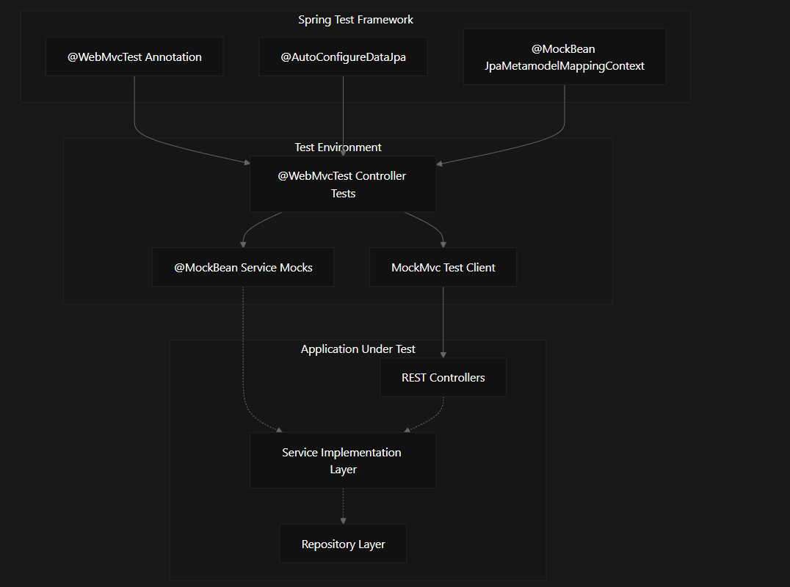
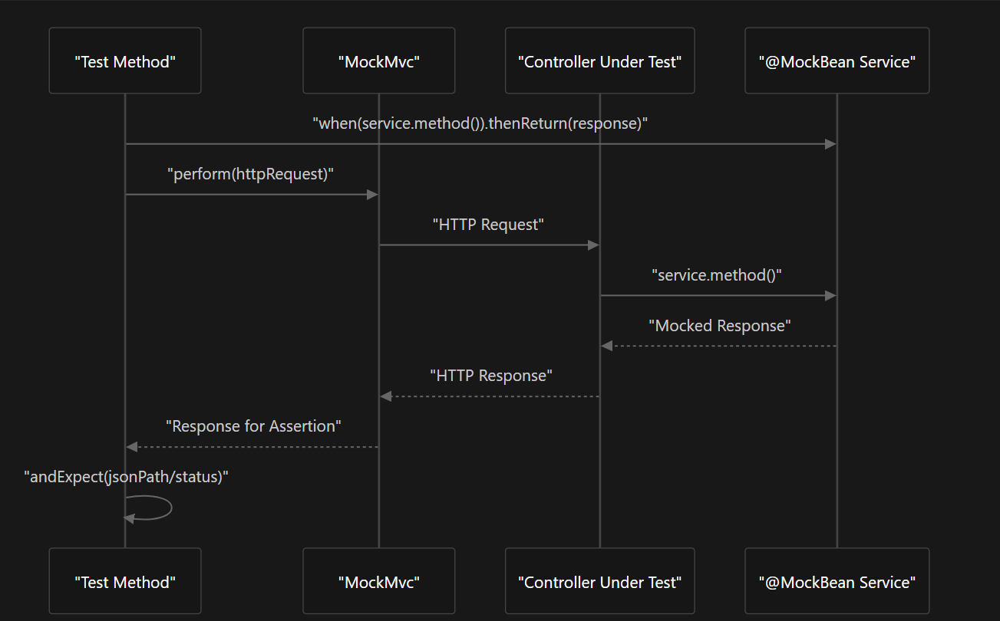
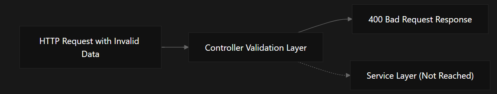

# Testing Framework

A comprehensive testing framework for the Student Management System Spring Boot application, focusing on controller integration tests that validate REST API behavior and ensure proper enforcement of API contracts and validation rules.

## 🎯 Purpose and Scope

This testing framework implements backend testing for the Spring Boot application with emphasis on:

- **Web layer integration testing** with isolated controller validation
- **REST API behavior verification** through comprehensive test coverage
- **Service layer mocking** to ensure clean separation of concerns
- **Input validation testing** to verify data integrity rules

For information about the actual REST API controllers being tested, see **REST API Layer**.  
For details about the service layer implementations that are mocked in these tests, see **Core Business Services**.

## 🏗️ Testing Architecture

The backend employs Spring Boot's testing framework with a focus on web layer integration testing. The architecture isolates the controller layer for testing while mocking all service dependencies.

### Spring Test Framework Components



### Test Flow Architecture



### Validation Testing Flow



## 🧪 Controller Test Implementation

### Test Class Structure

All controller tests follow a consistent structure using Spring Boot's web layer testing capabilities:

| Component               | Purpose                                    | Implementation                    |
| ----------------------- | ------------------------------------------ | --------------------------------- |
| `@WebMvcTest`           | Configures Spring MVC test context         | Targets specific controller class |
| `MockMvc`               | HTTP request testing client                | Injected via `@Autowired`         |
| `@MockBean`             | Service layer mocking                      | Mocks service implementations     |
| `@AutoConfigureDataJpa` | JPA configuration for data-dependent tests | Used in EmailDomainControllerTest |

### Test Method Naming Convention

The test classes implement comprehensive CRUD operation testing with consistent naming:

- `shouldGetAll{Entity}()` - Tests GET collection endpoints
- `shouldGet{Entity}ById()` - Tests GET single resource endpoints
- `shouldAdd{Entity}()` - Tests POST creation endpoints
- `shouldUpdate{Entity}()` - Tests PUT update endpoints
- `shouldDelete{Entity}()` - Tests DELETE endpoints

### Example Test Class Structure

```java
@WebMvcTest(EmailDomainController.class)
@MockBean(JpaMetamodelMappingContext.class)
class EmailDomainControllerTest {

    @Autowired
    private MockMvc mockMvc;

    @MockBean
    private EmailDomainServiceImpl service;

    @Test
    void shouldGetAllEmailDomains() throws Exception {
        // Test implementation
    }
}
```

## 🎭 Service Layer Mocking Strategy

### Mock Configuration

Each test class mocks its corresponding service implementation using `@MockBean`:

| Controller                | Mocked Service             | Mock Bean Declaration                                     |
| ------------------------- | -------------------------- | --------------------------------------------------------- |
| `EmailDomainController`   | `EmailDomainServiceImpl`   | `@MockBean EmailDomainServiceImpl service`                |
| `FacultyController`       | `FacultyServiceImpl`       | `@MockBean FacultyServiceImpl facultyService`             |
| `ProgramController`       | `ProgramServiceImpl`       | `@MockBean ProgramServiceImpl programService`             |
| `StudentStatusController` | `StudentStatusServiceImpl` | `@MockBean StudentStatusServiceImpl studentStatusService` |

### Mock Behavior Setup

Tests use Mockito's `when().thenReturn()` pattern to define expected service behavior:

```java
// Mock collection retrieval
when(service.getAllDomains()).thenReturn(emailDomains);

// Mock single entity retrieval
when(service.getDomainById(1)).thenReturn(emailDomain);

// Mock creation with argument matchers
when(service.createDomain(any(EmailDomainRequest.class))).thenReturn(emailDomain);

// Mock updates with specific ID matching
when(service.updateDomain(eq(1), any(EmailDomainRequest.class))).thenReturn(emailDomain);
```

## ✅ Request/Response Testing Pattern

### HTTP Status and JSON Response Validation

The tests validate both HTTP status codes and JSON response structure using Spring's MockMvc assertions:

```java
mockMvc.perform(get("/api/email-domains"))
    .andExpect(status().isOk())
    .andExpect(jsonPath("$.status").value(HttpStatus.OK.value()))
    .andExpect(jsonPath("$.data.length()").value(expectedCount))
    .andExpect(jsonPath("$.data[0].domain").value("example.com"));
```

### Common Assertion Patterns

- `.andExpect(jsonPath("$.status").value(HttpStatus.OK.value()))` - Status validation
- `.andExpect(jsonPath("$.data.length()").value(expectedCount))` - Collection size validation
- `.andExpect(jsonPath("$.data.fieldName").value("expectedValue"))` - Field value validation

## 🛡️ Validation Testing

### Input Validation Tests

The `EmailDomainControllerTest` includes comprehensive validation testing for domain format requirements:

| Test Method                              | Validation Rule                 | Expected Behavior         |
| ---------------------------------------- | ------------------------------- | ------------------------- |
| `shouldRejectDomainWithoutTLD()`         | Domain must have TLD            | Returns `400 Bad Request` |
| `shouldRejectDomainStartingWithHyphen()` | Domain cannot start with hyphen | Returns `400 Bad Request` |
| `shouldRejectBlankDomain()`              | Domain cannot be blank          | Returns `400 Bad Request` |

These tests verify that controller-level validation annotations and custom validators properly reject invalid input before reaching the service layer.

### Validation Test Example

```java
@Test
void shouldRejectDomainWithoutTLD() throws Exception {
    mockMvc.perform(post("/api/email-domains")
            .contentType(MediaType.APPLICATION_JSON)
            .content("{\"domain\": \"invalid-domain\"}"))
            .andExpect(status().isBadRequest())
            .andExpect(jsonPath("$.status").value(HttpStatus.BAD_REQUEST.value()));
}
```

## 📝 Test Data and Response Builders

### Response DTO Construction

Tests use builder patterns to construct response DTOs for mocking:

```java
// EmailDomain response
EmailDomainResponse.builder()
    .id(1)
    .domain("example.com")
    .build();

// Faculty response
FacultyResponse.builder()
    .id(1)
    .facultyName("Computer Science")
    .build();

// Program response
ProgramResponse.builder()
    .id(1)
    .programName("Computer Science")
    .build();

// StudentStatus response
StudentStatusResponse.builder()
    .id(1)
    .studentStatusName("Active")
    .build();
```

### JSON Request Payloads

HTTP requests use inline JSON strings for request bodies:

```java
// EmailDomain creation/update
"{\"domain\": \"example.com\"}"

// Faculty operations
"{\"facultyName\": \"Computer Science\"}"

// Program operations
"{\"programName\": \"Computer Science\"}"

// StudentStatus operations
"{\"studentStatusName\": \"Active\"}"
```

## ⚙️ Test Configuration Annotations

### JPA Metamodel Handling

Most controller tests include `@MockBean(JpaMetamodelMappingContext.class)` to prevent Spring from attempting to load JPA metamodel during web layer testing, since the service layer is mocked and no actual database operations occur.

The `EmailDomainControllerTest` uses `@AutoConfigureDataJpa` instead, suggesting it may have some data-dependent validation logic that requires JPA configuration.

### Web Layer Isolation

The `@WebMvcTest` annotation ensures that only web layer components are loaded, providing:

- **Fast test execution** by avoiding full application context loading
- **Isolation of controller logic** from service and repository layers
- **Automatic configuration of MockMvc** for HTTP testing

## 🚀 Running Tests

### Prerequisites

- Java 11+
- Maven 3.6+
- Spring Boot 2.7+

### Execute Tests

```bash
# Run all controller tests
mvn test -Dtest="*ControllerTest"

# Run specific controller test
mvn test -Dtest="EmailDomainControllerTest"

# Run with coverage report
mvn test jacoco:report
```

### Test Categories

```bash
# Web layer tests only
mvn test -Dgroups="web-layer"

# Validation tests
mvn test -Dtest="*ControllerTest" -Dtest.validation=true

# Integration tests
mvn test -Dtest="*IntegrationTest"
```

## 📊 Test Coverage

The testing framework covers:

- ✅ **HTTP Methods**: GET, POST, PUT, DELETE
- ✅ **Status Codes**: 200, 201, 400, 404, 500
- ✅ **Request Validation**: Input format, required fields, constraints
- ✅ **Response Structure**: JSON format, field mapping, status codes
- ✅ **Error Handling**: Validation errors, service exceptions
- ✅ **CRUD Operations**: Complete lifecycle testing

## 🤝 Contributing

When adding new controller tests:

1. Follow the established naming conventions
2. Use `@WebMvcTest` for web layer isolation
3. Mock all service dependencies with `@MockBean`
4. Include comprehensive validation testing
5. Test all CRUD operations and error scenarios
6. Maintain consistent assertion patterns

## 📄 File Structure

```
src/test/java/org/example/backend/controller/
├── EmailDomainControllerTest.java
├── FacultyControllerTest.java
├── ProgramControllerTest.java
├── StudentStatusControllerTest.java
└── [Other controller tests...]
```
