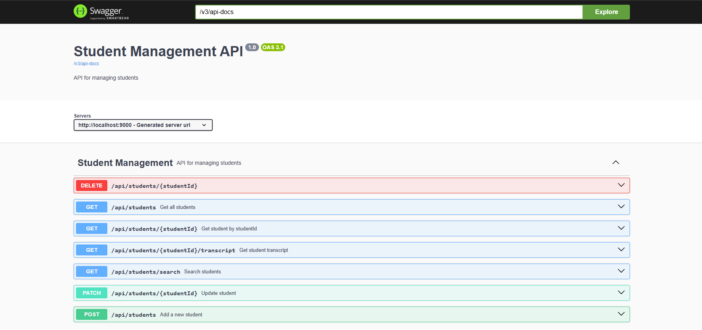
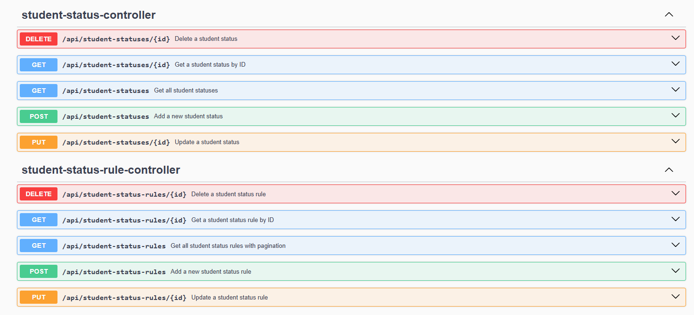
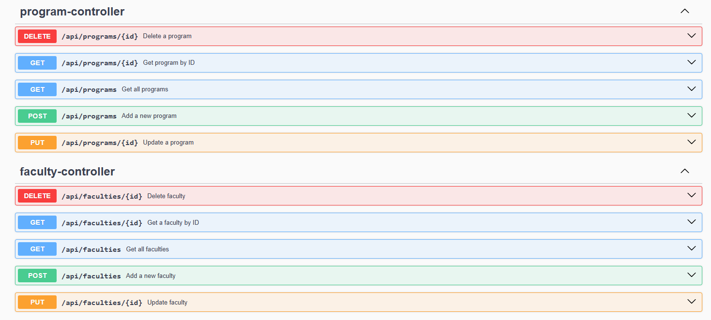
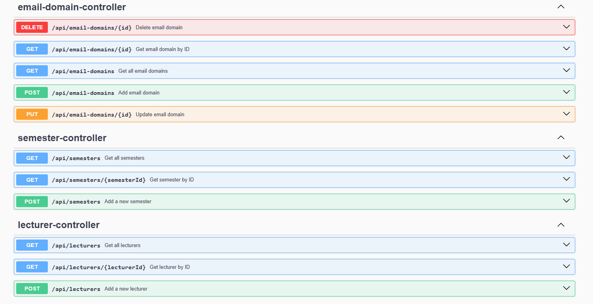
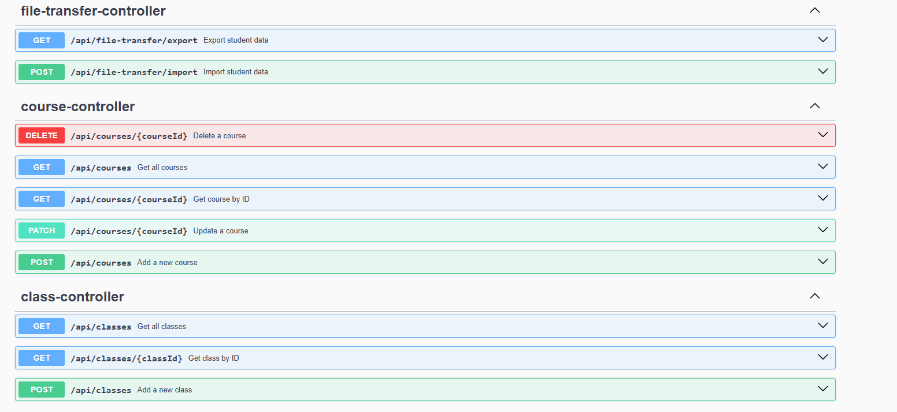
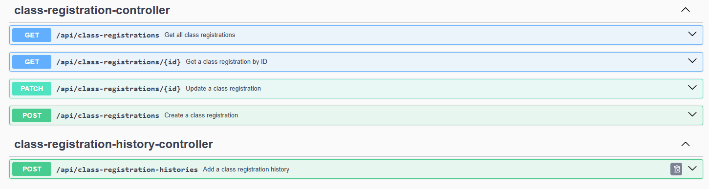
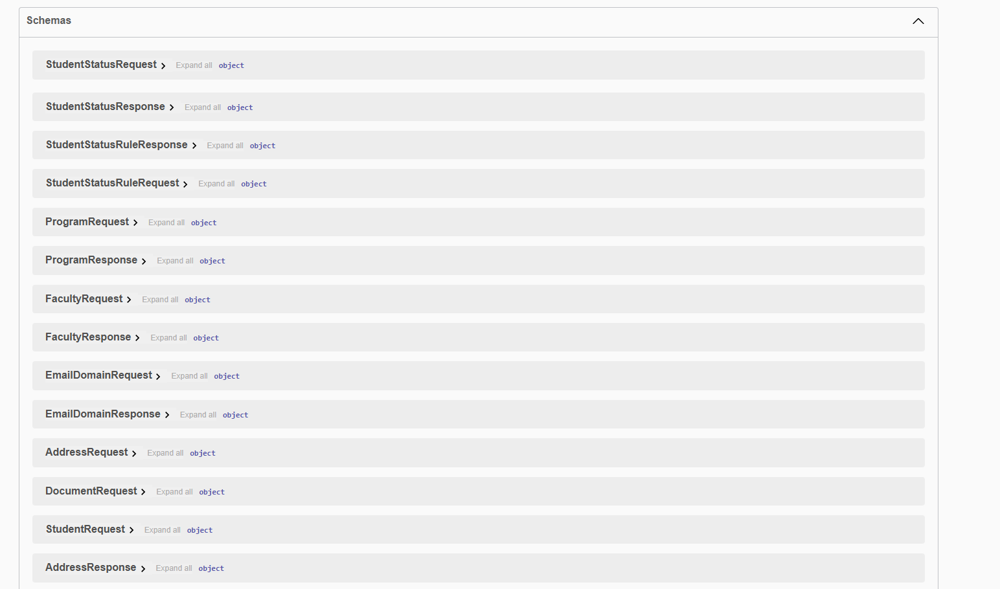
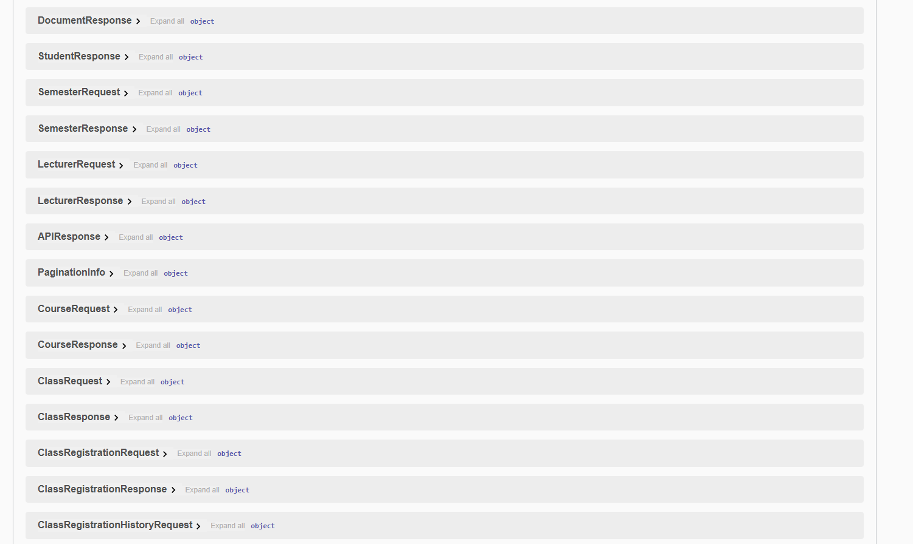
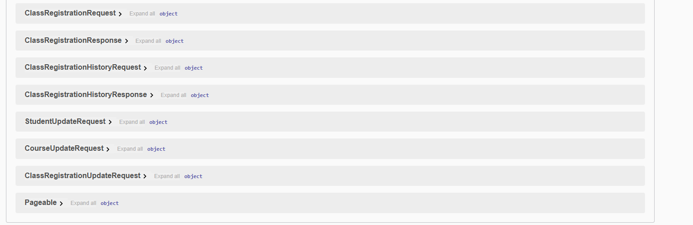

# 📚 API Documentation

Welcome to the API documentation!  
This API is described using the **OpenAPI 3.1** specification and can be explored interactively via Swagger UI.

---

## 🚀 Explore the API

**Swagger UI:**  
[http://localhost:9000/swagger-ui](http://localhost:9000/swagger-ui)

---

## 🖼️ Screenshots

Below are some screenshots of the Swagger UI and API documentation:

---

## 🔗 API Endpoints

Below is a summary of the main API endpoints grouped by feature. Each table lists the HTTP method, endpoint, and a brief description.

### 🧑‍🎓 Student Management

| Method | Endpoint                               | Description            |
| ------ | -------------------------------------- | ---------------------- |
| GET    | `/api/students`                        | Get all students       |
| GET    | `/api/students/{studentId}`            | Get student by ID      |
| GET    | `/api/students/{studentId}/transcript` | Get student transcript |
| GET    | `/api/students/search`                 | Search students        |
| PATCH  | `/api/students/{studentId}`            | Update student         |
| POST   | `/api/students`                        | Add a new student      |
| DELETE | `/api/students/{studentId}`            | Delete a student       |

### 📊 Student Status Management

| Method | Endpoint                     | Description              |
| ------ | ---------------------------- | ------------------------ |
| GET    | `/api/student-statuses`      | Get all student statuses |
| GET    | `/api/student-statuses/{id}` | Get student status by ID |
| POST   | `/api/student-statuses`      | Add a new student status |
| PUT    | `/api/student-statuses/{id}` | Update a student status  |
| DELETE | `/api/student-statuses/{id}` | Delete a student status  |

### 📋 Student Status Rules

| Method | Endpoint                         | Description                   |
| ------ | -------------------------------- | ----------------------------- |
| GET    | `/api/student-status-rules`      | Get all student status rules  |
| GET    | `/api/student-status-rules/{id}` | Get student status rule by ID |
| POST   | `/api/student-status-rules`      | Add a new student status rule |
| PUT    | `/api/student-status-rules/{id}` | Update a student status rule  |
| DELETE | `/api/student-status-rules/{id}` | Delete a student status rule  |

### 🎓 Program Management

| Method | Endpoint             | Description       |
| ------ | -------------------- | ----------------- |
| GET    | `/api/programs`      | Get all programs  |
| GET    | `/api/programs/{id}` | Get program by ID |
| POST   | `/api/programs`      | Add a new program |
| PUT    | `/api/programs/{id}` | Update a program  |
| DELETE | `/api/programs/{id}` | Delete a program  |

### 🏛️ Faculty Management

| Method | Endpoint              | Description       |
| ------ | --------------------- | ----------------- |
| GET    | `/api/faculties`      | Get all faculties |
| GET    | `/api/faculties/{id}` | Get faculty by ID |
| POST   | `/api/faculties`      | Add a new faculty |
| PUT    | `/api/faculties/{id}` | Update faculty    |
| DELETE | `/api/faculties/{id}` | Delete faculty    |

### 📧 Email Domain Management

| Method | Endpoint                  | Description            |
| ------ | ------------------------- | ---------------------- |
| GET    | `/api/email-domains`      | Get all email domains  |
| GET    | `/api/email-domains/{id}` | Get email domain by ID |
| POST   | `/api/email-domains`      | Add email domain       |
| PUT    | `/api/email-domains/{id}` | Update email domain    |
| DELETE | `/api/email-domains/{id}` | Delete email domain    |

### 📅 Semester Management

| Method | Endpoint                      | Description        |
| ------ | ----------------------------- | ------------------ |
| GET    | `/api/semesters`              | Get all semesters  |
| GET    | `/api/semesters/{semesterId}` | Get semester by ID |
| POST   | `/api/semesters`              | Add a new semester |

### 👨‍🏫 Lecturer Management

| Method | Endpoint                      | Description        |
| ------ | ----------------------------- | ------------------ |
| GET    | `/api/lecturers`              | Get all lecturers  |
| GET    | `/api/lecturers/{lecturerId}` | Get lecturer by ID |
| POST   | `/api/lecturers`              | Add a new lecturer |

### 📁 File Transfer

| Method | Endpoint                    | Description         |
| ------ | --------------------------- | ------------------- |
| GET    | `/api/file-transfer/export` | Export student data |
| POST   | `/api/file-transfer/import` | Import student data |

### 📚 Course Management

| Method | Endpoint                  | Description      |
| ------ | ------------------------- | ---------------- |
| GET    | `/api/courses`            | Get all courses  |
| GET    | `/api/courses/{courseId}` | Get course by ID |
| PATCH  | `/api/courses/{courseId}` | Update a course  |
| POST   | `/api/courses`            | Add a new course |
| DELETE | `/api/courses/{courseId}` | Delete a course  |

### 🏫 Class Management

| Method | Endpoint                 | Description     |
| ------ | ------------------------ | --------------- |
| GET    | `/api/classes`           | Get all classes |
| GET    | `/api/classes/{classId}` | Get class by ID |
| POST   | `/api/classes`           | Add a new class |

### 📝 Class Registration

| Method | Endpoint                        | Description                  |
| ------ | ------------------------------- | ---------------------------- |
| GET    | `/api/class-registrations`      | Get all class registrations  |
| GET    | `/api/class-registrations/{id}` | Get class registration by ID |
| PATCH  | `/api/class-registrations/{id}` | Update a class registration  |
| POST   | `/api/class-registrations`      | Create a class registration  |

### 🕓 Class Registration History

| Method | Endpoint                            | Description                      |
| ------ | ----------------------------------- | -------------------------------- |
| POST   | `/api/class-registration-histories` | Add a class registration history |

---

> For more details, refer to the full documentation or contact the development team.
